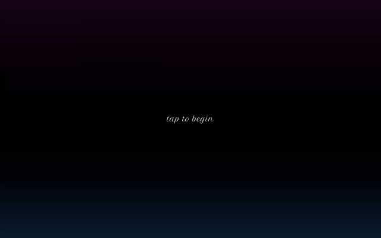
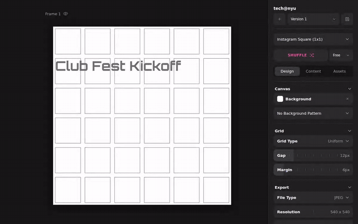
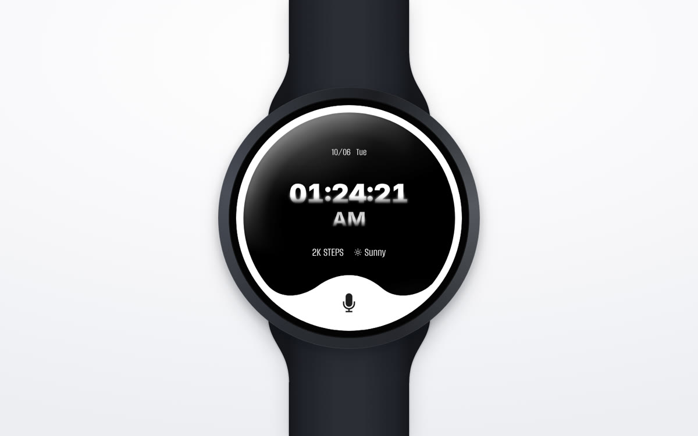
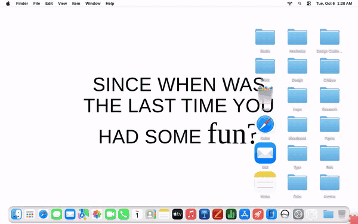
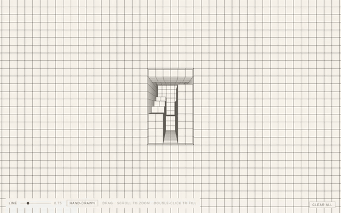
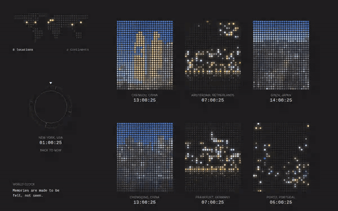
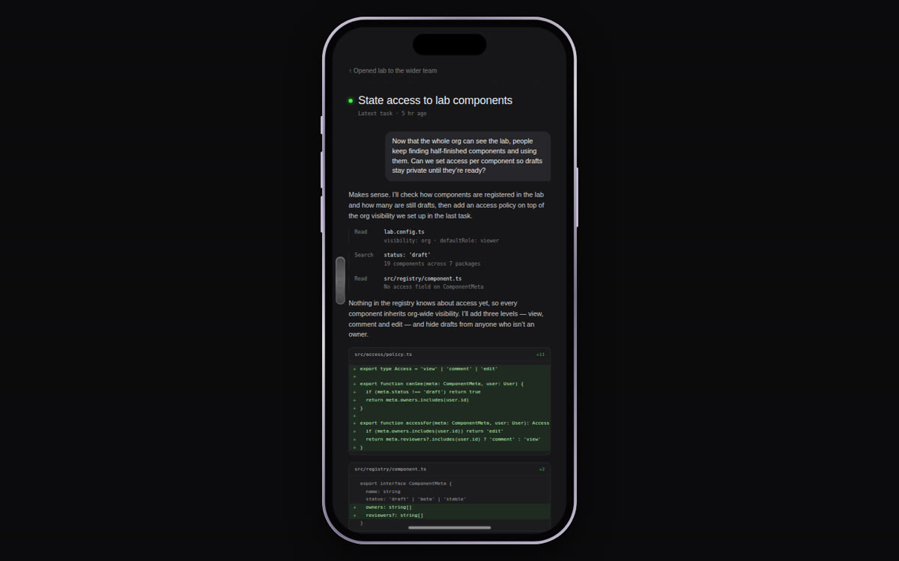

# Weekly Design Challenge

One small interactive piece a week, designed and built in code by Jennifer Huang.
Every project is a React + Vite app that runs in the browser.

**▶ See them all live: [jhfyj.github.io/DesignChallengeCode](https://jhfyj.github.io/DesignChallengeCode/)**

| | |
|---|---|
| [**01 · Night Market Ticket**](#01--night-market-ticket) | A ticket you tear along the perforation |
| [**02 · Event Poster Kit**](#02--event-poster-kit) | A grid-based poster generator for tech@nyu |
| [**03 · Round Watch Assistant**](#03--round-watch-assistant) | A voice assistant on a round smartwatch |
| [**04 · Since When Was the Last Time You Had Some Fun?**](#04--since-when-was-the-last-time-you-had-some-fun) | A desktop that lifts away onto a foam playmat |
| [**05 · Graph Paper Corridor**](#05--graph-paper-corridor) | A hand-drawn 3D space you can fly into |
| [**06 · World Clock**](#06--world-clock) | Photos from around the world, lit by their local time |
| [**Side project · Activity Log**](#side-project--activity-log) | An endless scroll of past tasks on a phone |

---

## 01 · Night Market Ticket



A digital ticket for the 626 Night Market. Tap the card to bring it close, then drag along the perforated line to tear off the stub. The tear sound follows how fast you drag, the card tilts toward the cursor, and the two halves come back together as a keepsake.

[Live demo](https://jhfyj.github.io/DesignChallengeCode/week-01-react/) · [Code](weeks/week-01-react)

## 02 · Event Poster Kit



A poster generator for tech@nyu events. Pick a format, fill in the event details and speakers, and the layout engine places everything on a grid. **Shuffle** proposes a new composition, colours and grid lines can be locked or dragged, photos get halftone and duotone treatments, and finished versions can be saved and exported as an image or PDF.

[Live demo](https://jhfyj.github.io/DesignChallengeCode/week-02-react/) · [Code](weeks/week-02-react)

## 03 · Round Watch Assistant



A voice assistant designed for a round watch face. Hold the mic and the rim turns into a live waveform from your microphone. When you let go, a ring works through each step (researching, locating, comparing…) and lands on a card suggesting a nearby restaurant, which you can accept or decline.

[Live demo](https://jhfyj.github.io/DesignChallengeCode/week-03-react/) · [Code](weeks/week-03-react)

## 04 · Since When Was the Last Time You Had Some Fun?



A familiar macOS desktop with one question across it. Click the red foam piece peeking out of the corner and the desktop lifts away, ring by ring, onto a playmat of interlocking foam tiles. Click anywhere on the mat to send a new wave of colour across it.

[Live demo](https://jhfyj.github.io/DesignChallengeCode/week-04-react/) · [Code](weeks/week-04-react)

## 05 · Graph Paper Corridor



A sheet of graph paper with a hole in it. Scroll to push the camera through the opening into a corridor drawn entirely in grid lines. Drag to slide around, double-click to fill, and switch on **Hand-drawn** for a sketchier line. The renderer is written from scratch on a 2D canvas.

[Live demo](https://jhfyj.github.io/DesignChallengeCode/week-05-react/) · [Code](weeks/week-05-react)

## 06 · World Clock



*Memories are made to be felt, not seen.* Photos of cities around the world, redrawn as fields of dots that are lit by each city's real local time: blue skies by day, glowing windows at night. Turn the dial to move through the day, and add your own photo and place.

[Live demo](https://jhfyj.github.io/DesignChallengeCode/week-06-react/) · [Code](weeks/week-06-react)

## Side project · Activity Log



A phone-sized history that never runs out. Scroll or drag the tick rail to scrub back through past tasks, and rest on one to open its full conversation.

[Live demo](https://jhfyj.github.io/DesignChallengeCode/random-week-06-react/) · [Code](weeks/random-week-06-react)

---

## Running it locally

Each week is its own npm workspace under `weeks/`. From the repo root:

```bash
npm install
npm run dev                  # runs the week named in week.config.json
npm run dev -- --week=3      # or pick one
npm run build -- --week=3
```

### Starting a new week

1. `npm create vite@latest weeks/week-07-react -- --template react`
2. `npm install` at the repo root.
3. Set `{ "current": "week-07-react" }` in `week.config.json`.
4. Add a section to this README and a card to `site/index.html`.

### The showcase site

`.github/workflows/pages.yml` builds every folder in `weeks/` on each push to `main` and publishes them with the landing page in `site/` to GitHub Pages. Inside a project, load files from `public/` with `import.meta.env.BASE_URL + 'file.mp3'` rather than `'/file.mp3'`, so they still work when the site lives in a subfolder.
